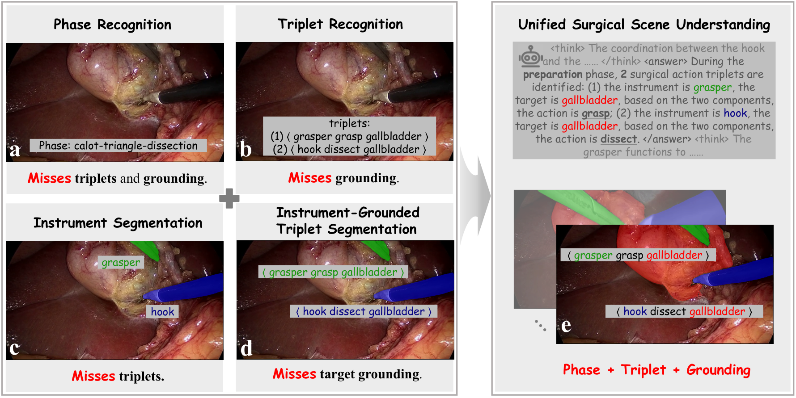
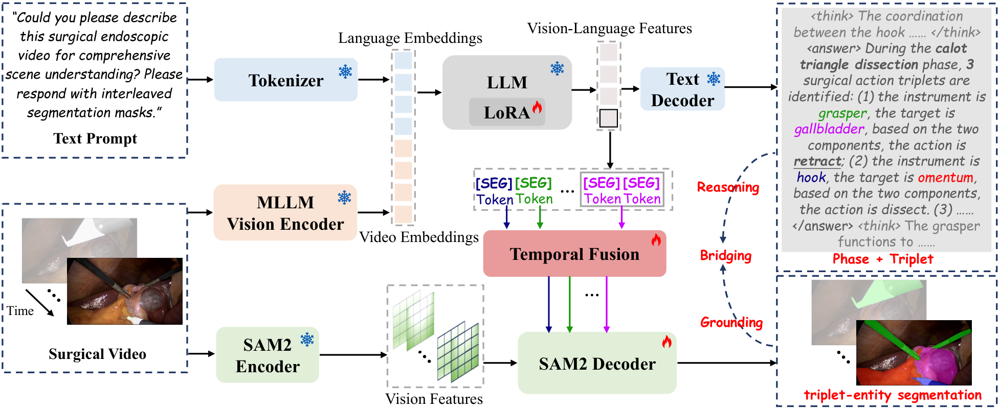

# Towards Unified Surgical Scene Understanding: Bridging Reasoning and Grounding via MLLMs

## 🧠 Model Architecture





## 📝 Abstract

Surgical scene understanding is essential for AI-assisted intervention, yet real-world clinical applications require a holistic understanding of procedural context, semantic reasoning, and precise visual grounding. However, existing approaches typically address these components in isolation, leading to fragmented representations and limited semantic consistency. To address this limitation, we propose SurgMLLM, a unified surgical scene understanding framework that bridges high-level reasoning and low-level visual grounding. Given surgical videos, SurgMLLM fine-tunes a multi-modal large language model (MLLM) to support structured interpretability reasoning over phases, instrument-verb-target ($IVT$) triplets, and triplet-entity segmentation tokens. These tokens are then temporally aggregated and serve as prompts for a segmentation network, enabling accurate pixel-wise grounding of instruments and targets. The framework is trained end-to-end with a unified objective that couples language-based reasoning supervision with visual grounding losses. To facilitate unified evaluation, we introduce CholecT45-Scene, extending CholecT45 dataset with 64,299 frames of pixel-level mask annotations for instruments and targets, aligned with existing triplet labels. Extensive experiments show that SurgMLLM improves the primary triplet recognition metric AP$_{IVT}$ from 40.7\% to 46.0\% and consistently outperforms prior methods in phase recognition and segmentation. These results highlight the effectiveness of unified reasoning-and-grounding for reliable, context-aware surgical assistance.

## 🛠️ Installation

Run every command below from the repository root. The tested setup uses Python 3.10, PyTorch 2.10.0 with CUDA 12.8, and FlashAttention 2.7.3.

```bash
export PATH="$HOME/.local/bin:$PATH"
command -v uv >/dev/null || curl -LsSf https://astral.sh/uv/install.sh | sh
uv --version
cd /path/to/SurgMLLM
bash scripts/install_env.sh
source .venv/bin/activate
```

The installer pins the direct core packages but is not a transitive lockfile installation. FlashAttention is compiled after PyTorch is installed.

## 📦 Pretrained Model Preparation

Download the required pretrained models from the upstream Hugging Face pages:

- [InternVL2_5-4B](https://huggingface.co/OpenGVLab/InternVL2_5-4B)
- [sam2_hiera_large.pt](https://huggingface.co/facebook/sam2-hiera-large)

Expected layout:

```text
pretrained/
├── InternVL2_5-4B/
│   ├── config.json
│   ├── model-00001-of-00002.safetensors
│   └── ...
└── sam2_hiera_large.pt
```

`SAM2_CHECKPOINT` must point to the original `sam2_hiera_large.pt`. Do not substitute `sam2.1_hiera_large.pt`, the Hugging Face `model.safetensors`, or the SAM2 repository directory.

## 🗂️ Data Preparation

Prepare the scene dataset with the following layout:

```text
CholecT45-Scene/
├── annotations/
│   ├── VID01_GCG.json
│   └── ...
└── videos/
    ├── VID01/
    │   ├── 000001.png
    │   └── ...
    └── ...
```

Each annotation record must provide a caption, instrument/target groundings, and a consistent image identity. A data-free structural example is available at [`examples/synthetic_5frame.json`](examples/synthetic_5frame.json).

## ⚙️ Configuration

The runner already provides defaults for the config, epoch-5 checkpoint, output directories, and eight GPUs. Copy the environment template and edit only `SURGMLLM_DATA_ROOT` when the pretrained models use the layout above:

```bash
cp .env.example .env
# Edit SURGMLLM_DATA_ROOT in .env before continuing.
set -a
source .env
set +a
```

Load `.env` once in every new shell. The runner does not read it automatically.
The three input paths are required for a full run; `WORK_DIR` and `GPUS` are optional overrides that already match the runner defaults.

## 🚀 Quick Start

Run training, conversion, distributed inference, and evaluation with one command:

```bash
PYTHONPATH=. bash run_surgmllm_llm_fold1.sh
```

The default outputs are:

| Artifact | Path |
|---|---|
| Training checkpoints and log | `work_dirs/surgmllm_llm_fold1/` |
| Converted Hugging Face model | `models/HF_SurgMLLM_fold1/` |
| Raw predictions | `predictions/fold1/raw_predictions.json` |
| Metrics | `metrics/fold1/` |

To continue from an existing epoch checkpoint, set `CHECKPOINT`; the runner will skip training and execute conversion, inference, and evaluation:

```bash
PYTHONPATH=. CHECKPOINT="$WORK_DIR/epoch_1.pth" \
  HF_DIR="$PWD/models/HF_SurgMLLM_epoch_1" \
  bash run_surgmllm_llm_fold1.sh
```

## 🏋️ Training

```bash
PYTHONPATH=. bash tools/dist.sh train \
  projects/surgmllm/configs/surgmllm_llm_fold1.py "$GPUS" \
  --work-dir "$WORK_DIR"
```

## 🔄 Convert to Hugging Face

```bash
PYTHONPATH=. python tools/convert_surgmllm_to_hf.py \
  projects/surgmllm/configs/surgmllm_llm_fold1.py \
  "$WORK_DIR/epoch_5.pth" \
  --save-path models/HF_SurgMLLM_fold1
```

`models/HF_SurgMLLM_fold1` must not already exist; choose a fresh `--save-path` for each conversion. The converter audits all trainable checkpoint keys and reloads the exported model through the Hugging Face remote-code interface before completing.

## 🔍 Inference

```bash
PYTHONPATH=. torchrun --standalone --nproc_per_node="$GPUS" \
  projects/surgmllm/evaluation/surgmllm_infer_gcg_fold1.py \
  --model models/HF_SurgMLLM_fold1 \
  --data-root "$SURGMLLM_DATA_ROOT" \
  --split fold1 \
  --window-size 5 \
  --window-stride 5 \
  --output predictions/fold1/raw_predictions.json
```

Use `--max-windows 1` for a bounded inference smoke check.

## 📊 Evaluation

```bash
PYTHONPATH=. python -m projects.surgmllm.evaluation \
  --predictions predictions/fold1/raw_predictions.json \
  --data-root "$SURGMLLM_DATA_ROOT" \
  --split fold1 \
  --output-dir metrics/fold1 \
  --skip-vis
```

Remove `--skip-vis` and add `--vis-dir visualizations/fold1` to render mask overlays. See the [evaluation guide](projects/surgmllm/evaluation/README.md) for the standalone commands and output files.

## ✅ Tests

```bash
source .venv/bin/activate
PYTHONPATH=. pytest -q
bash -n run_surgmllm_llm_fold1.sh tools/dist.sh scripts/install_env.sh
```

## 📄 License and Acknowledgements

SurgMLLM is released under the [Apache License 2.0](LICENSE). The engineering workflow and selected components build on [Sa2VA](https://github.com/bytedance/Sa2VA/tree/main/projects/sa2va), [SAM 2](https://github.com/facebookresearch/sam2), [InternVL](https://github.com/OpenGVLab/InternVL), and [FastChat](https://github.com/lm-sys/FastChat). See [NOTICE](NOTICE), [THIRD_PARTY.md](THIRD_PARTY.md), and [LICENSE_InternVL](LICENSE_InternVL) for attribution and license details.
